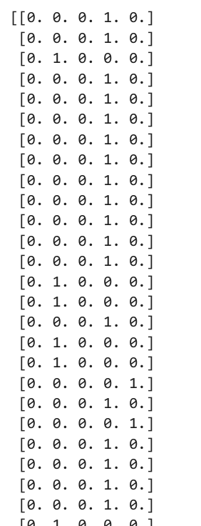
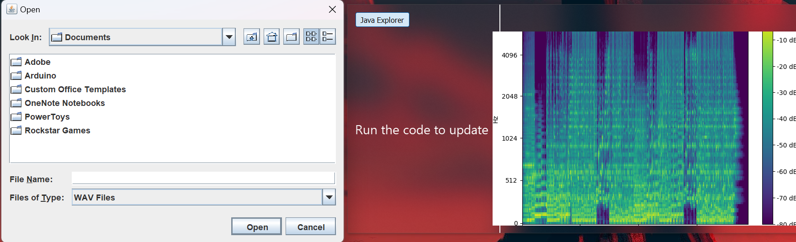
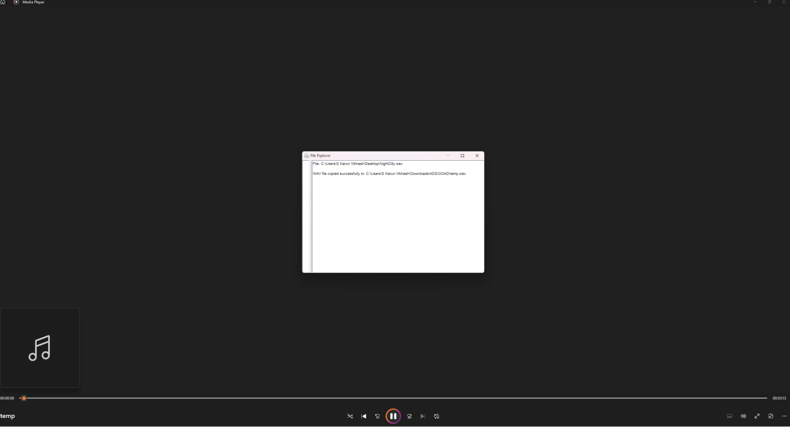
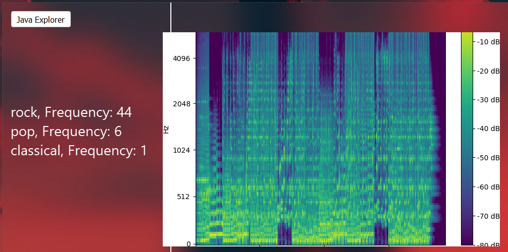
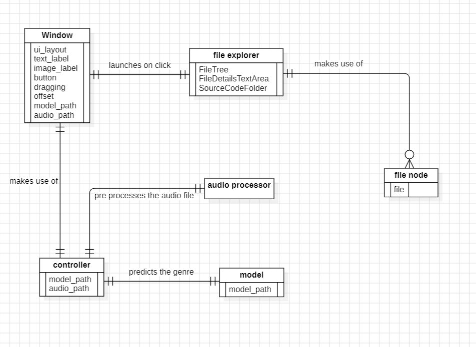

# Music-Classifier
The Music Categorizer system aims to categorize newly uploaded music tracks into predefined genres, moods, and styles using machine learning algorithms.

The modules used here are:
1. Librosa
2. Tensorflow
3. Matplotlib
4. Numpy

`librosa` is a Python package for music and audio analysis. It provides the building blocks necessary to create music information retrieval (MIR) systems which is paired with `TF` to design neural networks and to save the models for consumers.
`Matplotlib` plays a very important role in creating the spectrogram where it enables the code to visualize the sounds in the form of waves as follows


`Numpy` also plays a vital role which helps in interpreting the images in the form  of matrices and helps in matrix calculations while training the model

## Music Genre Classifier Model Creation:


In the above diagram, the input is given in the form of a mp3 or wav file for training. Each file is labeled as we will be following the principles of supervised learning. For the sake of uniformity and preventing overfitting, we slice the clips to appropriate sizes so that the model is efficient and accurate. These files are converted to an image form using Matplotlib where the sounds are converted to a spectrogram. The model is initiated, tested, and trained. Once done, it's stored so that it's not required to be trained again in the form of h5 models.

We have implemented the same logic as a sound classifier below

<p align="center">
  
  
</p>

## Walkthrough
### Input Dataset
For training purposes, we have used <a href="https://www.kaggle.com/datasets/andradaolteanu/gtzan-dataset-music-genre-classification">GTZAN</a> dataset which consists of 10 genres and each genre has 100 songs in the form of WAV format

### Adding labels to genres
To add labels to the files, we are using the concept of one-hot encoding, for example, if  we have 5 genres, then the encoding is as follows.
```
#0 is for classical  [1, 0, 0, 0, 0]
#1 is for hiphop [0, 1, 0, 0, 0]
#2 is for jazz [0, 0, 1, 0, 0]
#3 is for pop [0, 0, 0, 1, 0]
#4 is for rock [0, 0, 0, 0, 1]
```

### Slicing
This is a crucial step in our model as this step helps the model to be stable. All the files are sliced exactly into 5 second segments. This size was chosen based on statistics (Dunno how accurate it's gonna be :P )

### Converting to spectogram
Each of these slices is converted to spectrograms which help during training.

### Initiate the training
The current model consists of 5 layers of neural networks
<ul type="disc">qua
<li>2 convolutional networks</li>
<li>1 flatten network </li>
<li>2 dense networks where the last dense network will contain only 5 nodes as they correspond to the genres.</li>
</ul>

<dl>
  <dt>Convolutional Networks</dt>
  <dd>Convolutional networks are used in music genre classification because they excel at recognizing patterns in music, making them a powerful tool for identifying genres. They do this by detecting musical elements like rhythms and melodies, enabling them to differentiate between different music styles accurately.</dd>
  
  <dt>Flatten</dt>
  <dd>Flatten is used after convolutional networks to transform the extracted features into a one-dimensional format, which is essential for compatibility with traditional machine learning algorithms. This step simplifies the data, making it suitable for classification methods and improving genre prediction.</dd>
  
  <dt>Dense Networks</dt>
  <dd>Dense networks, often referred to as fully connected layers, are employed after convolutional layers to capture complex patterns and relationships in the extracted features. They enhance the model's ability to recognize intricate patterns in music, improving genre classification accuracy.</dd>
</dl>

### Feeding and saving the model
Once the model is set up we feed the audio slices and train the model. The trained model is then stored.

## Reusing the model

To reuse the model we need sufficient RAM (about 16GB) to load the model and feed the music in the wav or mp3 format. Once done it is converted to a spectrogram which in turn is converted to an array similar to this:



## Limitations
1. Music input compatibility
2. Resources required for the model
3. Model Overfitting
4. Data quality and time availability

## Use Case Diagram


## Graphical UI







## Entity Relation



## Conclusion

The Music Categorizer project offers a solution to organizing and categorizing music efficiently (sort of). Leveraging advanced machine learning, it automates tagging music tracks with genres, enhancing music discovery and enjoyment for users.
