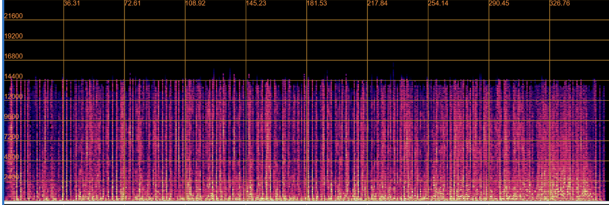
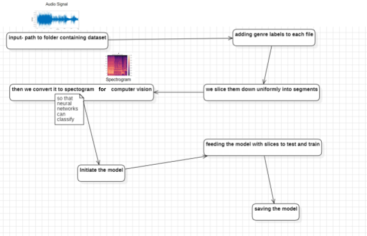
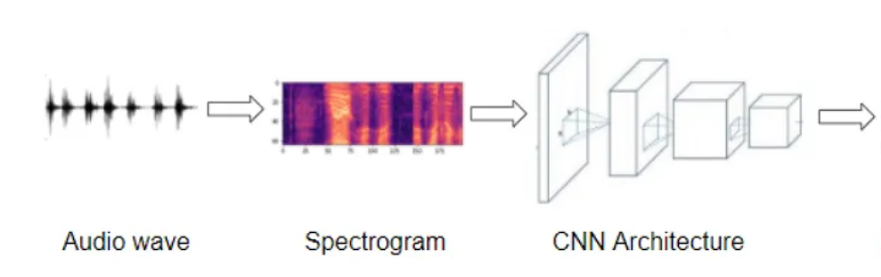
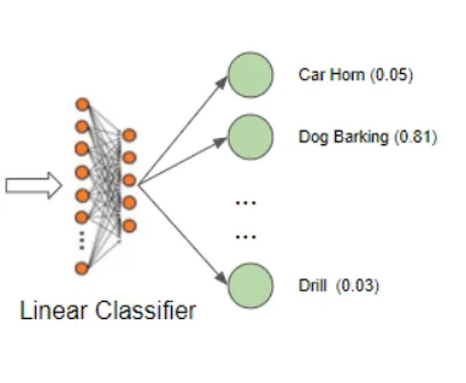

# Music-Classifier
The Music Categorizer system aims to categorize newly uploaded music tracks into predefined genres, moods, and styles using machine learning algorithms.

The modules used here are:
1. Librosa
2. Tensorflow
3. Matplotlib
4. Numpy

`librosa` is a Python package for music and audio analysis. It provides the building blocks necessary to create music information retrieval (MIR) systems which is paired with `TF` to design neural networks and to save the models for consumers.
`Matplotlib` plays a very important role in creating the spectrogram where it enables the code to visualize the sounds in the form of waves as follows

`Numpy` also plays a vital role which helps in interpreting the images in the form  of matrices and helps in matrix calculations while training the model

## Music Genre Classifier Model Creation:

In the above diagram, the input is given in the form of a mp3 or wav file for training. Each of the files is labeled as we will be following the principles of supervised learning. For the sake of uniformity and preventing overfitting, we slice the clips to appropriate sizes such that the model is efficient as well as accurate. These files are converted to an image form using matplotlib where the sounds are converted to a spectrogram. The model is initiated, tested, and trained. Once done, its stored so that it's not required to be trained again in the form of h5 models.

We have implement the same logic as a sound classifier as below

  
  

